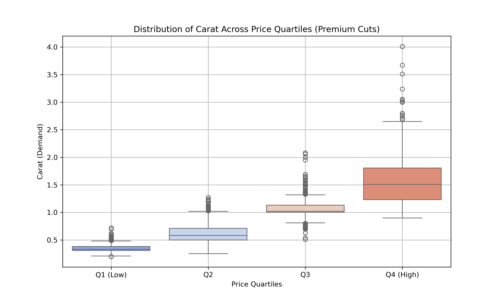

# 📈 Premium Diamond Cuts: Demand Elasticity Analysis

An insightful data analysis project focusing on **Premium diamond cuts** to uncover the relationship between price and demand. This project calculates the **elasticity coefficient**, performs exploratory data analysis, and visualizes key trends with simple yet impactful plots.

---

## 🌟 Project Highlights

### ✨ Key Objectives:
1. Analyze how changes in price impact demand (measured by carat weight) for **Premium diamond cuts**.
2. Compute the **elasticity coefficient**, quantifying the percentage change in demand for a 1% price change.
3. Provide visual insights through:
   - **Scatter plots**: Explore the relationship between price and demand.
   - **Boxplots**: Reveal demand distribution across price quartiles.

### 📊 Dataset:
The project uses the built-in `diamonds` dataset from the `seaborn` library. This dataset provides detailed information about over 50,000 diamonds, including features like:
- **Carat**: The weight of the diamond.
- **Cut**: Quality of the cut (e.g., Premium, Ideal).
- **Price**: Price in US dollars.

For this analysis, the data is filtered to focus exclusively on **Premium** cuts.

---

## 🧠 Analysis Process

### 1️⃣ Data Preparation:
- Filtered the dataset to include only **Premium** cuts.
- Retained relevant columns: `cut`, `carat`, and `price`.
- Ensured no missing or invalid values for accurate analysis.

### 2️⃣ Elasticity Calculation:
- Log-transformed `price` and `carat` for a linear relationship.
- Used **Ordinary Least Squares (OLS)** regression to calculate the **elasticity coefficient**:
  \[
  \text{Elasticity} = \frac{\% \text{Change in Demand (Carat)}}{\% \text{Change in Price}}
  \]
- Interpretation: A positive or negative coefficient indicates how demand reacts to price changes.

### 3️⃣ Visualization:
#### 📍 **Scatter Plot**:
Visualizes the relationship between price and demand, with a grid to identify patterns easily.

#### 📍 **Boxplot (Price Quartiles vs Carat)**:
Shows the distribution of carat weights within different price quartiles, highlighting variability in demand.

---

## 🚀 Features

### 🔬 Elasticity Insights:
- Compute and display the **elasticity coefficient** for Premium cuts.
- Interactive price simulation: Predict demand for any given price.

### 📊 Visualizations:
- **Scatter Plot**: Easy-to-interpret relationship between price and demand.
- **Boxplot**: A deeper look at demand distribution across price quartiles.

### 🛠️ Exportable Results:
- Save analyzed data, including predicted demand, into a CSV file for further exploration.

---

## 📷 Screenshots

### Elasticity Coefficient

### Scatter Plot

### Boxplot

